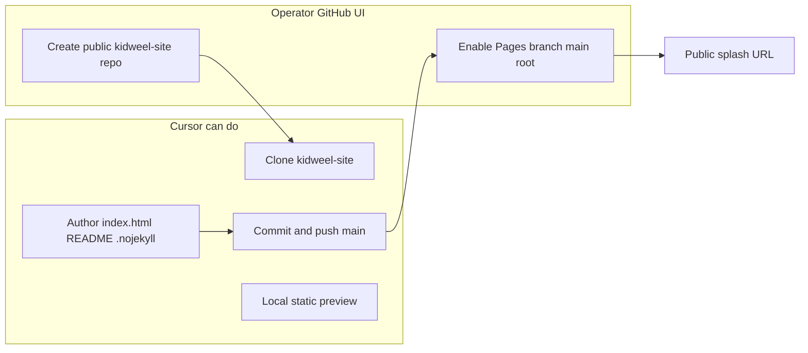

# KIDWEEL-SPLASH-GROUNDWORK-C1

## Critical answers (verified in this environment)


| Question                                          | Answer                               | Evidence                                                                                                                                                                    |
| ------------------------------------------------- | ------------------------------------ | --------------------------------------------------------------------------------------------------------------------------------------------------------------------------- |
| 1. Create a new GitHub repo from Cursor?          | **No**                               | `gh repo create VadeOneBX/kidweel-site` → `Resource not accessible by integration (createRepository)`                                                                       |
| 2. Push `index.html` + `README.md`?               | **Yes, after repo exists**           | `git push --dry-run` to `kidweel-capstone` succeeds; same GitHub App token should push to `kidweel-site` once the empty repo is created and the app retains org/user access |
| 3. Configure GitHub Pages settings?               | **No**                               | `gh api repos/.../pages` → `403 Resource not accessible by integration` (read and create both blocked)                                                                      |
| 4. Set Pages to branch `main`, folder `/` (root)? | **Not from Cursor**                  | Pages API unavailable; must use GitHub UI                                                                                                                                   |
| 5. Desktop fallback required for                  | **Repo creation + Pages enablement** | File authoring, commit, and push can run from Cursor after repo exists                                                                                                      |


**Blocker summary:** The Cursor Cloud GitHub integration token (`cursor` app install) lacks `createRepository` and Pages administration scopes. It can perform git operations on repos the app already reaches (confirmed for `[kidweel-capstone](https://github.com/VadeOneBX/kidweel-capstone)`).

**Repo status:** `[VadeOneBX/kidweel-site](https://github.com/VadeOneBX/kidweel-site)` does **not** exist yet. Current workspace is the implementation repo (`kidweel-capstone`) — splash files must **not** land here per packet doctrine (public Pages site separate from implementation).




---

## Implementation approach (two-phase)

### Phase A — Operator prerequisite (one-time, ~2 min)

Create an empty **public** repository before Cursor pushes:

1. GitHub → **New repository**
2. Owner: `VadeOneBX`
3. Name: `kidweel-site`
4. Public
5. **No** README, `.gitignore`, or license (keeps first push clean)
6. Create repository

No Cursor action until this exists (or Pack 1 stops at file handoff).

### Phase B — Cursor execution (after repo exists)

Work **outside** `[kidweel-capstone](https://github.com/VadeOneBX/kidweel-capstone)`:

```bash
cd /tmp
git clone https://github.com/VadeOneBX/kidweel-site.git
cd kidweel-site
# write files (see below)
git add index.html README.md .nojekyll
git commit -m "Add Kidweel splash v1 — operator-approved baseline"
git push -u origin main
```

**Do not** use a `cursor/*-da43` branch or open a PR against `kidweel-capstone` — this packet targets a standalone site repo publishing from `main` at root.

#### Files (exact packet content, no redesign)


| File                       | Notes                                                                                                                                                                        |
| -------------------------- | ---------------------------------------------------------------------------------------------------------------------------------------------------------------------------- |
| `[index.html](index.html)` | Operator-supplied HTML verbatim — includes baseline comment `KIDWEEL SPLASH v1 — GPT / OPERATOR APPROVED BASELINE`, footer doctrine line, artifact router, `#contact` anchor |
| `[README.md](README.md)`   | Minimal packet copy                                                                                                                                                          |
| `[.nojekyll](.nojekyll)`   | Empty file — suppresses Jekyll on GitHub Pages for raw static HTML                                                                                                           |


**Language / link checklist (already in supplied HTML — verify, do not edit copy):**

- Hero + footer: *live paper-trading validation*, *no live capital authority*
- Artifacts: Capstone (`View repo →`), GEX Dashboard (`View artifact →`), AI Job Hunt (`Request walkthrough →` → `#contact`)
- Contact: email, LinkedIn, GitHub only (no capstone in Contact)
- Forbidden terms absent: no “AI trading bot,” “autonomous trading,” “signals,” “guaranteed alpha,” “live execution”
- No JS, frameworks, Jekyll config, or build pipeline

#### Local verification (before push)

```bash
cd /tmp/kidweel-site
python3 -m http.server 8765
# curl -s -o /dev/null -w "%{http_code}" http://127.0.0.1:8765/   # expect 200
# spot-check: #contact anchor, mailto, external artifact hrefs
```

### Phase C — Operator Pages enablement (required)

Cursor **cannot** complete this step. Exact UI path:

1. Open `https://github.com/VadeOneBX/kidweel-site`
2. **Settings** → **Pages**
3. **Build and deployment** → **Source**: *Deploy from a branch*
4. **Branch**: `main` · **Folder**: `/` (root)
5. **Save**
6. Wait ~1–2 min; site URL will be `https://vadeonebx.github.io/kidweel-site/` (or custom domain if later configured)

GitHub note (per packet): Pages sites are public even when the source repo is private on eligible plans — keeping `kidweel-site` separate from `kidweel-capstone` is correct posture.

---

## Fallback if operator cannot create repo before Cursor runs

If Phase A is skipped, Cursor will still:

1. Write the three files to a handoff location (e.g. cloud agent artifacts or a documented path)
2. Deliver the full desktop sequence from the packet:

```
Create repo kidweel-site → add index.html → add README.md → push main
→ Settings → Pages → Deploy from branch → main → / root → Save
```

Pack 1 acceptance for links/content can still be met via local static preview; Pages URL requires Phase C.

---

## Acceptance mapping


| Criterion                        | How verified                                                           |
| -------------------------------- | ---------------------------------------------------------------------- |
| `index.html` exists at repo root | File in `kidweel-site` root                                            |
| `README.md` exists               | Same                                                                   |
| Page renders                     | `python3 -m http.server` local preview; post-Phase C, GitHub Pages URL |
| Real contact links               | `mailto:Wesleypadams@gmail.com`, LinkedIn, GitHub profile              |
| Capstone + GEX links present     | Artifact cards in HTML                                                 |
| AI Job Hunt → `#contact`         | `href="#contact"` on walkthrough CTA                                   |
| Baseline comment in HTML         | `<!-- KIDWEEL SPLASH v1 — GPT / OPERATOR APPROVED BASELINE -->`        |
| Pages setup report               | **Not possible from Cursor** — document Phase C UI steps               |
| No Jekyll / build                | Static HTML only + `.nojekyll`; no `Gemfile`, workflows, or npm        |


---

## Risk / dependency

- **Repo creation** is the gating item. Without `kidweel-site`, Cursor can author and preview locally but cannot complete push-based acceptance.
- **Pages API 403** is a platform scope limit, not a fixable code issue — no workaround via `ManagePullRequest` or git alone.
- After operator creates the repo, if `git push` fails (app not installed on new repo), operator must grant the Cursor GitHub App access to `kidweel-site`, then retry push.

